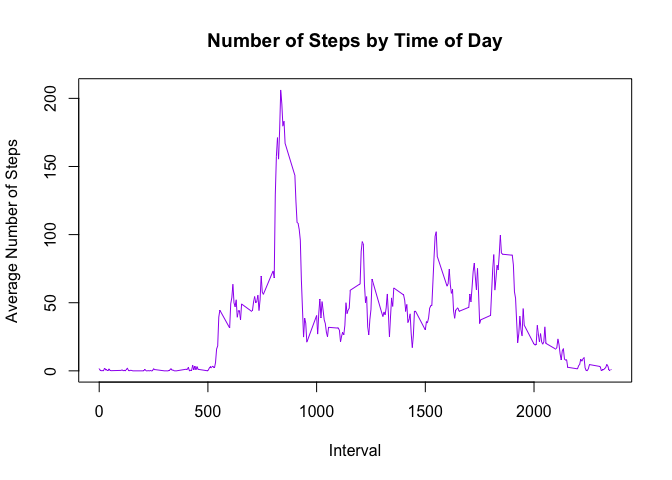

# Reproducible Research - Project 1
NML DesJardins  
August 11, 2015  

# Loading and preprocessing the data  

**Load the data:**  


```r
setwd("~/Downloads")
data<-read.csv("activity.csv", na.strings="NA")
head(data)
```

```
##   steps       date interval
## 1    NA 2012-10-01        0
## 2    NA 2012-10-01        5
## 3    NA 2012-10-01       10
## 4    NA 2012-10-01       15
## 5    NA 2012-10-01       20
## 6    NA 2012-10-01       25
```

**Reformat date from factor to date:**  


```r
data$date<-as.Date(data$date)
str(data)
```

```
## 'data.frame':	17568 obs. of  3 variables:
##  $ steps   : int  NA NA NA NA NA NA NA NA NA NA ...
##  $ date    : Date, format: "2012-10-01" "2012-10-01" ...
##  $ interval: int  0 5 10 15 20 25 30 35 40 45 ...
```

# What is mean total number of steps taken per day?

**Compute the total number of steps per day:**  


```r
library(dplyr)
steps.per.date<-data%>%
        group_by(date)%>%
        do({
               x<-as.data.frame(sum(.$steps,na.rm=T))
        })
colnames(steps.per.date)<-c("date", "total_steps")
steps.per.date
```

```
## Source: local data frame [61 x 2]
## Groups: date
## 
##          date total_steps
## 1  2012-10-01           0
## 2  2012-10-02         126
## 3  2012-10-03       11352
## 4  2012-10-04       12116
## 5  2012-10-05       13294
## 6  2012-10-06       15420
## 7  2012-10-07       11015
## 8  2012-10-08           0
## 9  2012-10-09       12811
## 10 2012-10-10        9900
## ..        ...         ...
```

**Make a historgram of the total number of steps taken each day:**  


```r
hist(steps.per.date$total_steps, main="Number of Steps per Day", xlab="Steps", 
     col="purple")
```

 


```r
mean.steps<-round(mean(steps.per.date$total_steps, na.rm=T))
median.steps<-median(steps.per.date$total_steps,na.rm=T)
hilo<-ifelse(mean.steps>median.steps, "lower","higher")
```

**On average, this person took 9354 steps per day. The median number of 
steps was somewhat higher, at 10395 steps per day.**  

******

# What is the average daily activity pattern?  

**Compute average number of steps within each interval:**  


```r
steps.per.interval<-data%>%
        group_by(interval)%>%
        do({
               x<-as.data.frame(mean(.$steps,na.rm=T))
        })
colnames(steps.per.interval)<-c("interval", "avg_steps")
steps.per.interval
```

```
## Source: local data frame [288 x 2]
## Groups: interval
## 
##    interval avg_steps
## 1         0 1.7169811
## 2         5 0.3396226
## 3        10 0.1320755
## 4        15 0.1509434
## 5        20 0.0754717
## 6        25 2.0943396
## 7        30 0.5283019
## 8        35 0.8679245
## 9        40 0.0000000
## 10       45 1.4716981
## ..      ...       ...
```

**Time series plot of average steps per interval, across all days:**  


```r
with(steps.per.interval, plot(interval, avg_steps, type="l", xlab="Interval", 
                              ylab="Average Number of Steps", 
                              main="Number of Steps by Time of Day", col="purple"))
```

 


```r
maxstep<-steps.per.interval[which(steps.per.interval$avg_steps==
                                          max(steps.per.interval$avg_steps)),]
```

**On average, this person took the most steps during the interval at 835.**    
  
******

# Imputing Missing Values   


```r
nmiss<-table(is.na(data))[2]
```

**There are a total of 2304 missing values in the dataset.**  
  
    
**Impute missing values with the mean for that interval to create a new dataset:** 
  

```r
data.mi<-merge(data,steps.per.interval)
data.mi$steps=with(data.mi,ifelse(is.na(steps==T),avg_steps,steps))
table(is.na(data.mi))
```

```
## 
## FALSE 
## 70272
```

```r
head(data.mi)
```

```
##   interval    steps       date avg_steps
## 1        0 1.716981 2012-10-01  1.716981
## 2        0 0.000000 2012-11-23  1.716981
## 3        0 0.000000 2012-10-28  1.716981
## 4        0 0.000000 2012-11-06  1.716981
## 5        0 0.000000 2012-11-24  1.716981
## 6        0 0.000000 2012-11-15  1.716981
```

**Compute total number of steps each day:**  

```r
steps.per.date.mi<-data.mi%>%
        group_by(date)%>%
        do({
               x<-as.data.frame(sum(.$steps))
        })
colnames(steps.per.date.mi)<-c("date", "total_steps_mi")
steps.per.date.mi
```

```
## Source: local data frame [61 x 2]
## Groups: date
## 
##          date total_steps_mi
## 1  2012-10-01       10766.19
## 2  2012-10-02         126.00
## 3  2012-10-03       11352.00
## 4  2012-10-04       12116.00
## 5  2012-10-05       13294.00
## 6  2012-10-06       15420.00
## 7  2012-10-07       11015.00
## 8  2012-10-08       10766.19
## 9  2012-10-09       12811.00
## 10 2012-10-10        9900.00
## ..        ...            ...
```


**Histogram of the total number of steps each day:**  

```r
with(steps.per.date.mi,hist(total_steps_mi, main="Number of Steps per Day", 
                            xlab="Steps (mean imputed)", col="blue"))
```

 

```r
options(scipen=999)
mean.steps.mi<-round(mean(steps.per.date.mi$total_steps_mi))
median.steps.mi<-round(median(steps.per.date.mi$total_steps_mi))

hilo.mi<-ifelse(mean.steps.mi>median.steps.mi,"higher than",
                ifelse(mean.steps.mi<median.steps.mi,"lower than","equal to"))

skew<-ifelse(hilo.mi=="equal to", "The mean and median are now equivalent, 
             indicating that the data are no longer skewed.","As in the raw data, 
             the mean and median are not equivalent, indicating that the data 
             are still at least somewhat skewed.")

hilo_mean<-ifelse(mean.steps.mi>mean.steps, "higher than",
                  ifelse(mean.steps.mi<mean.steps,"lower than", "equal to"))
hilo_mdn<-ifelse(median.steps.mi>median.steps, "higher than",
                 ifelse(median.steps.mi<median.steps,"lower than","equal to"))
```
**After replacing missing values with the means for each interval, this person took, on average, 10766 steps per day, which is higher than the mean obtained from the raw data. The median number of steps (after mean imputation) was 10766, which is higher than the median obtained from the raw data. The mean and median are now equivalent, 
             indicating that the data are no longer skewed.**  
  
    
******

# Differences in activity patterns between weekends and weekdays  
  
**Create a factor variable for weekdays vs. weekends:**  

```r
data.mi$daytype<-as.factor(with(data.mi, ifelse(weekdays(data$date)=="Sunday"| 
                                              weekdays(data$date)=="Saturday",
                                      "weekend","weekday")))
str(data.mi$daytype)
```

```
##  Factor w/ 2 levels "weekday","weekend": 1 1 1 1 1 1 1 1 1 1 ...
```


**Compute the mean number of steps for each interval across weekdays or weekends:**  

```r
steps.int.day<-data.mi%>%
        group_by(daytype,interval)%>%
        do({
               x<-as.data.frame(mean(.$steps))
        })
colnames(steps.int.day)<-c("daytype","interval", "avg_steps")
steps.int.day
```

```
## Source: local data frame [304 x 3]
## Groups: daytype, interval
## 
##    daytype interval avg_steps
## 1  weekday        0 1.7169811
## 2  weekday        5 0.3396226
## 3  weekday       10 0.1320755
## 4  weekday       15 0.1509434
## 5  weekday       20 0.0754717
## 6  weekday       25 2.0943396
## 7  weekday       30 0.5283019
## 8  weekday       35 0.8679245
## 9  weekday       40 0.0000000
## 10 weekday       45 1.4716981
## ..     ...      ...       ...
```

**Create a time series plot of the average number of steps on weekdays and weekends:**  

```r
library(ggplot2)
p<-ggplot(steps.int.day,aes(interval,avg_steps))
p + geom_line() + facet_grid(daytype~.) + labs(x = "Interval", y = "Number of steps")
```

 
